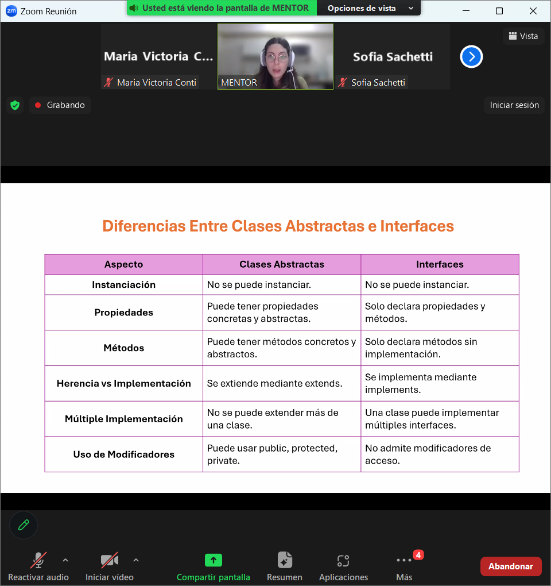

# ABSTRACCION
SIMPLIFICAR EL DESARROLLO Y LA LECTURA DEL CODIGO AL REDUCIR LA CANTIDAD DE INFO INNECESARIA QUE EL PROGRAMADROE NECESITA MANEJAR.

-REDUCE LA COMPLEJIDAD
-SEPARA RESPONSABILIDADES-MODULARIZACION PARA NO AFECTAR OTRAS PARTES DEL CODIGO
-REUTILIZACION DEL CODIGO

### buena practica usar protected como modificador de acceso con la clase abstract

### no hace falta definir las propiedaddes primero como el la interfaz

interfaz
nombre:tipo;

constructor(nombre:string){
    this.nombre = nombre;
}

En clase abstrata se puede hacer directamente el constructor.

# INTERFACES
Firma: la firma de un metodo o funcion es su definicion (nombre, tipo y num d parametros, tipo de retorno)

### propiedades OPCIONALES
-se declara con el operador ?

### propiedad SOLO LECTURA
readonly
son inmutables, se les asigna un valor 1 vez y no se pueden cambiar-reasignar valor

diferencias clases abstractas y interfaces

