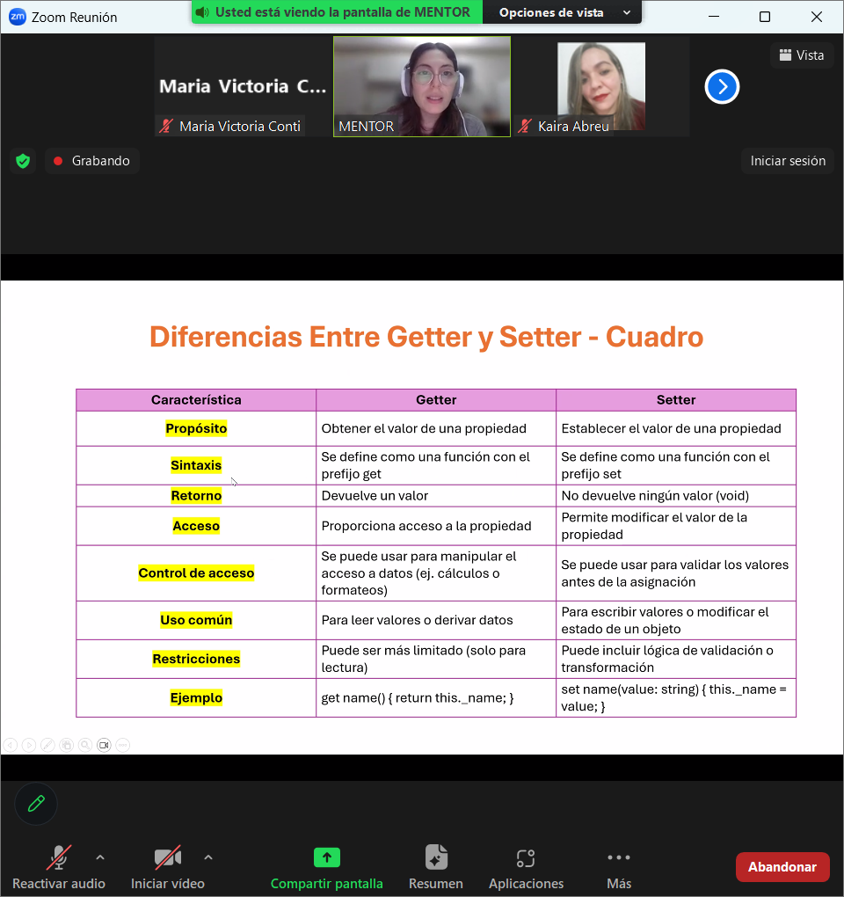

# GET
OBTENER, TRAER. ES UN METODO QUE BRINDA MAYOR SEGURIDAD. LOS DATOS ESTAN PROTEGIDOS. se usa solo para lectura. Acceso a propiedades.

# SET
permite modificar el valor de una propiedad - valida valores antes de la asignacion - modifica estado del objeto - incluye logica de validacion o transfomacion. Buena practica no exagerar con la logica dentro de los setter. solo para validar.

Sirven para mantener altos niveles de # ENCAPSULACION

